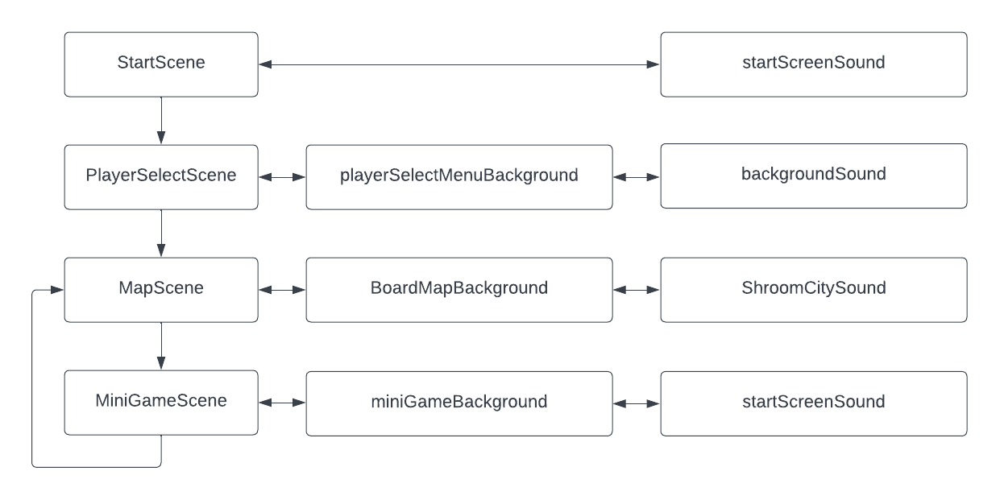

# Mario Party Advance Clone

Mario Party Advance Clone of the game "Mario Party" for the Game Boy Advance. Originally created and published by Nintendo Co., Ltd. All rights reserved.
The game engine is developed by Wouter Groeneveld.
This project is created as second change to submit a project for "Software ontwerp in C/C++".

# Scenes

The game exist out the startScene, PlayerSelectScene, MapScene and the MiniGameScene.
Each with is own background and sound as shown.
The PlayerSelectScene is the menu to choose the player, there are two functional players, Mario and Luigi.
After selecting the player the mapScene will open. THe player can walk on the path of the city and can start the minigame by selecting the blue dice.
The minigame start, the task is to avoid the Goomba and jump to the QuestionBlock to collect points.
If you have three points, you won. But if the Goomba hits you, you loose.

